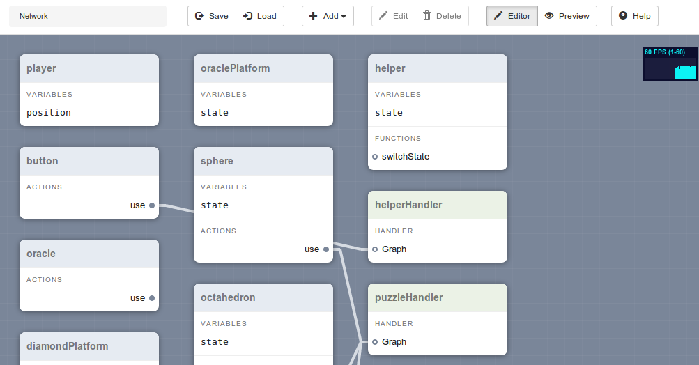

Conductor
=========

Conductor is a system for dynamic, portable interaction design.

Setup
-----

* Download and install Node.js
* Install Bower: `npm install -g bower`
* Run `npm install`
* Run `bower install`

Running
-------

* Run `npm test`
* Open your browser to [http://127.0.0.1:8080]

Files
-----

* `app.js`: main file that contains the runners for logic and world engine loops
* `bindmap.js`: handles binding logic objects to world objects
* `condition.js`: evaluates logic functions
* `editor.js`: handles editor user interface
* `graph.js`: generic Conductor-specific graph object, used for handlers and networks
* `graph_utils.js`: handles preparation of a graph object for use with logic engine
* `handler.js`: event handler graph evaluator
* `network.js`: network graph evaluator, i.e. the logic engine
* `ops.js`: operators used in logic functions
* `templates.js`: templates used by the editor
